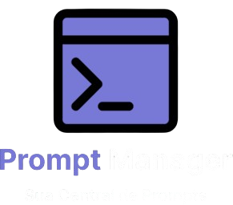

<div align="center">
  
</div>

<br>

<h2>
  📜 Sobre o Projeto
</h2>

<p>
  O Prompt Manager é um aplicativo web simples e intuitivo para organizar seus prompts de IA. Ele permite cadastrar, editar 
  e buscar rapidamente, aumentando sua produtividade.<br>
  <br>
  Desenvolvido em um evento, utilizamos um protótipo no Figma e ferramentas de IA para gerar rapidamente a base do código (Design-to-Code). 
  Contudo, a revisão e os ajustes manuais foram essenciais para garantir a qualidade do código gerado, aplicando conceitos de Arquitetura Web e Design.
</p>

<br>

<h2>
  ✨ Funcionalidades
</h2>

* **Responsividade:** Layout totalmente adaptado a desktops, notebooks, tablets e smartphones.
* **Organização Centralizada:** Gerencia todos os prompts de IA em um único lugar (barra lateral).
* **Acesso Rápido:** Busca e Filtragem de prompts por título (campo "Buscar por título...").
* **Criação Fácil:** Cadastro de novos prompts (botão "Novo prompt").
* **Edição Completa:** Visualização e Edição do título e conteúdo de cada prompt selecionado.
* **Reutilização Imediata:** Botão "Copiar" para transferir o conteúdo do prompt para a área de transferência rapidamente.
* **Persistência de Dados:** Botão "Salvar" para salvar ou atualizar as edições feitas no prompt.
* **Gestão da Lista:** Exclusão rápida de prompts na lista lateral (ícone de lixeira/cesto de lixo).

<br>

<h2>
  🛠️ Tecnologias Utilizadas
</h2>
<p>
  Este projeto foi construído com as seguintes tecnologias:
</p>
<br>
<div>
  
  
  
  
  
  
</div>
<br>

*   **HTML5:** Para a estrutura e semântica do conteúdo.
*   **CSS3:** Para estilização, layout e animações.
*   **JavaScript:** Para interatividade e manipulação do DOM.
*   **Git e GitHub:** Para versionamento de código e hospedagem.

<br>

<h2>
  🚀 Como Executar o Projeto
</h2>

Para visualizar o projeto localmente, siga os passos abaixo:

1.  **Clone o repositório:**
    ```bash
    git clone https://github.com/vitorf2003/promptmanager.git
    ```

2.  **Navegue até a pasta do projeto:**
    ```bash
    cd promptmanager
    ```

3.  **Abra o arquivo `index.html` no seu navegador de preferência.**

E pronto! Você já pode explorar o site.

---
<br>

## ✒️ Autor

Feito por **Vitor Faria**.

*   **LinkedIn:** [Vitor Faria](https://www.linkedin.com/in/vitor-faria-3865321b5)
*   **GitHub:** [@vitorf2003](https://github.com/vitorf2003)
